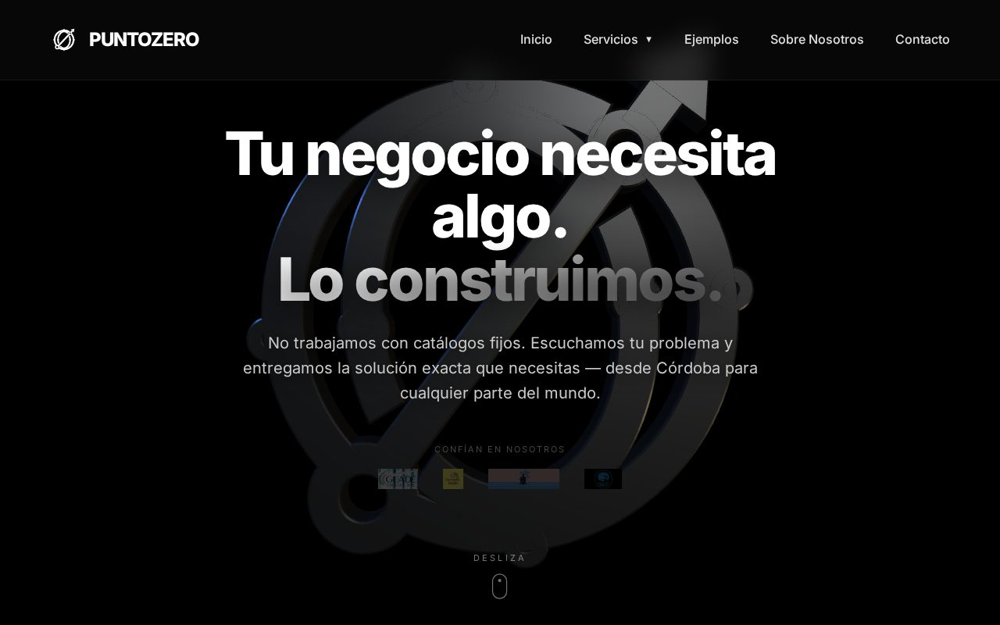

# PuntoZero

Web corporativa de PuntoZero, software y webs a medida para negocios locales de Córdoba.

🔗 **[puntozerosl.es](https://puntozerosl.es/)**

## Qué incluye

- Landing con logo 3D interactivo y animaciones de scroll
- Sección de ejemplos de negocios reales
- Contacto directo por WhatsApp
- Subpáginas de proyectos (pizzerías, La Juana, clips, AR)

## Tecnologías

     

---

Parte de [PuntoZero](https://puntozerosl.es).
